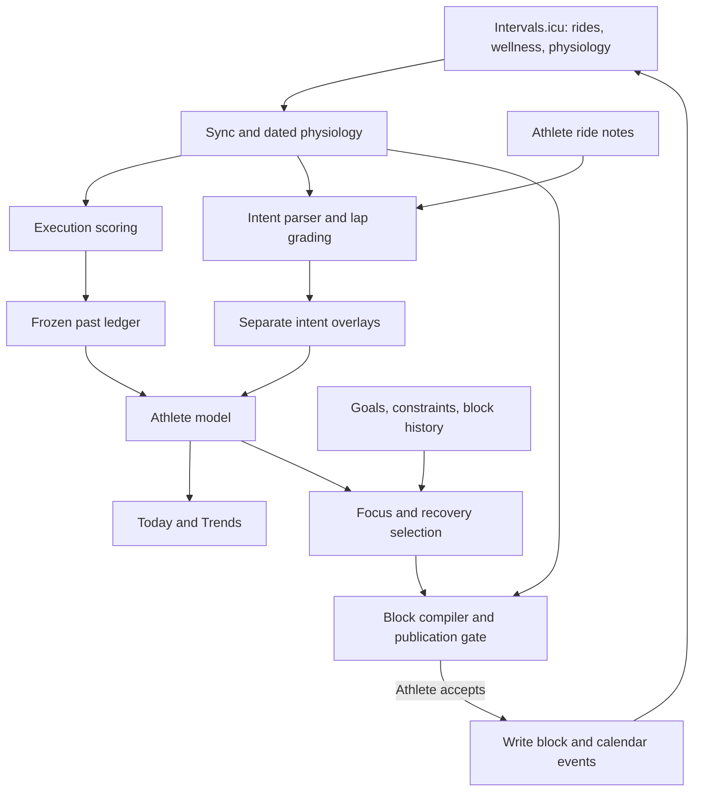

# Compass

**Understand the product:** [README](../README.md) · **Choose work:** [ROADMAP](../ROADMAP.md#follow-this-queue) ·
**Start/finish a task:** [WORKFLOW](../WORKFLOW.md) · **Agent rules:** [AGENTS](../AGENTS.md)

## The mental model (60 seconds)

Three kinds of state drive NodeVelo: synced physiology, athlete-owned intent, and execution history.
The engines turn them into daily guidance and a block proposal; acceptance writes to Intervals.icu.

| Boundary | What crosses it |
|---|---|
| `app/api/` → `lib/` | Routes read stores, resolve inputs, invoke engines, and persist results |
| Stores → UI | `GET /api/sync` supplies shared state; page-specific routes supply the rest |
| Engine → Anthropic | Precomputed ride/closeout facts for optional language; no plan composition |
| Closeout → history | Execution evidence and optional reflections; reflections do not feed the compiler |

## I need to…

Start with the relevant row, then inspect its callers/tests. [FILE_INDEX](FILE_INDEX.md) is the
module lookup; it is not a prerequisite reading list.

| Observed result / change | Trace in code | System reference |
|---|---|---|
| Sync is stale, a zone changed, or a store looks wrong | `app/api/sync/route.ts` → `physiology.ts`, `json-store.ts` | [01 · Data](systems/01-sync-and-data.md) |
| A ride's score or stated intent looks wrong | `execution-score.ts` / `intent-scoring.ts` → `score-log.ts` / overlays → `athlete-model.ts` | [02 · Scoring](systems/02-scoring-and-learning.md) |
| Today's readiness, suggested ride, or morning override | `athlete-state.ts`, `session-suggestion.ts`, `morning-check.ts` → `dashboard/today.tsx` | [03 · Daily loop](systems/03-daily-loop.md) |
| A retrospective or editable knowledge file | `api/retrospective` → `block-closeout.ts`, `kb-loader.ts` | [04 · Knowledge](systems/04-knowledge.md) |
| Why this training focus or season projection? | `season-signals.ts` → `season.ts` | [05 · Season](systems/05-season.md) |
| Wrong session/duration, rejected preview, or publication failure | `api/generate` → `block-skeleton.ts` → `block-compiler.ts` → `publication-gate.ts` → `api/write` | [06 · Generation](systems/06-generation.md) |
| Wrong AI wording or cost | `anthropic-prompts.ts` → `anthropic-api.ts`, `ai-usage.ts` | [07 · AI](systems/07-ai-layer.md) |
| A page, interaction, or stale client state | `app/` → page component → `SyncProvider.tsx` / route | [08 · Frontend](systems/08-frontend.md), [DESIGN](../DESIGN.md) |
| Wrong calorie target, buffer, or calibration | `nutrition.ts`: `resolveNutritionModel` → `resolveBuffer` → `calculateDailyTarget` | [09 · Nutrition](systems/09-nutrition.md) |

Bare engine filenames above are in `lib/`; UI files are in `components/`; `api/` means `app/api/`.
Change procedures: [Recipes](RECIPES.md). Vocabulary: [Glossary](GLOSSARY.md).

## Session rituals

1. Identify checkout, local changes, and integrated revision ([dirty-checkout procedure](../WORKFLOW.md#dirty-primary-checkout)).
2. Read the task's system doc and relevant [invariants](INVARIANTS.md); inspect the actual inputs and consumers.
3. Verify the result, update its owning doc below, and finish through [Workflow](../WORKFLOW.md#codex-workflow).

## Documentation ownership

| Changed fact | Edit here |
|---|---|
| Product purpose or setup | [README](../README.md) |
| User operation or material limit | [FEATURES](../FEATURES.md) |
| Work order / prerequisite | [ROADMAP](../ROADMAP.md); defect acceptance lives in [todo](../todo.md) |
| Data flow or subsystem behavior | Its system doc above; shared hard contracts in [INVARIANTS](INVARIANTS.md) |
| Operating rule / command procedure | [AGENTS](../AGENTS.md) / [WORKFLOW](../WORKFLOW.md), with affected helpers |
| Durable decision / shipped result | [DECISIONS](DECISIONS.md) / [shipment history](history/shipments.md) |

Link to the owner instead of copying its explanation. Use a table for independent rules and a diagram
for data flow; retain prose where it explains a tradeoff. Keep stable IDs and code pointers. Derive
file counts and callers from source rather than documenting snapshots.

## The full doc set (one question each)

The live map is above. Conditional references: [UX principles](../UX-CONSTITUTION.md),
[folder rules](../lib/README.md), [agent tracker adapter](agents/issue-tracker.md).
[History](history/README.md) indexes old reviews, specs, plans, and research. Open it for a named
question; an old checklist or `CONTINUE.md` handoff does not select today's work.

## For AI agents

Trace a disputed claim to code, not another document. Pay particular attention to **stored vs used**
(reflections, directives), **planned vs ridden** (season exposure), and **deterministic vs provider-independent**
(Today finalization). Those distinctions have already drifted in these docs.
