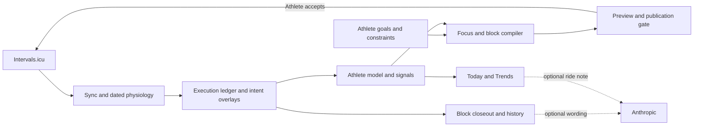

# Compass

Start here to work on NodeVelo. Read the mental model once, then open only the row relevant to
your task. [README](../README.md) introduces the product; [ROADMAP](../ROADMAP.md#follow-this-queue)
selects work; [WORKFLOW](../WORKFLOW.md) explains how to deliver it.

## The mental model (60 seconds)

NodeVelo is a local, single-athlete training loop. Intervals.icu supplies measured data; the athlete
supplies intent. Deterministic engines derive evidence and compile plans. AI adds optional wording.

`lib/` contains engines and persistence adapters; `app/api/` orchestrates IO; pages and
`components/` present the results. JSON in `data/` is runtime state. Markdown in `knowledge-base/`
is personal reference/history, not compiler authority. Both runtime directories are gitignored.

## I need to…

| Task | Read | Start in code |
|---|---|---|
| Understand sync, storage, backup, or physiology | [01 · Data](systems/01-sync-and-data.md) | `app/api/sync/route.ts`, `lib/json-store.ts`, `lib/physiology.ts` |
| Change execution scoring, intent, or learning | [02 · Evidence](systems/02-scoring-and-learning.md) | `lib/execution-score.ts`, `lib/intent-scoring.ts`, `lib/athlete-model.ts` |
| Change Today, readiness, or a morning decision | [03 · Daily loop](systems/03-daily-loop.md) | `components/dashboard/today.tsx`, `lib/athlete-state.ts` |
| Change reference notes or retrospective records | [04 · Knowledge](systems/04-knowledge.md) | `lib/kb-loader.ts`, `lib/block-closeout.ts` |
| Understand focus selection or season outlook | [05 · Season](systems/05-season.md) | `lib/season.ts`, `lib/season-signals.ts` |
| Debug or change a generated block or publication | [06 · Generation](systems/06-generation.md) | `lib/block-compiler.ts`, `lib/publication-gate.ts`, `app/api/write/route.ts` |
| Change an AI language path | [07 · AI](systems/07-ai-layer.md) | `lib/anthropic-prompts.ts`, `lib/anthropic-api.ts` |
| Change a page or interaction | [08 · Frontend](systems/08-frontend.md), [DESIGN](../DESIGN.md) | `components/ui.tsx`, relevant page/component |
| Change nutrition or explain its uncertainty | [09 · Nutrition](systems/09-nutrition.md) | `lib/nutrition.ts` |
| Follow a change procedure | [Recipes](RECIPES.md) | Then read the relevant implementation and tests |
| Find a module or route | [File index](FILE_INDEX.md) | `rg --files lib app/api components` for the current inventory |
| Decode a term / understand a constraint | [Glossary](GLOSSARY.md), [Invariants](INVARIANTS.md) | Read only the relevant contracts |
| Understand a decision or old review | [Decisions](DECISIONS.md), [History](history/README.md) | Follow a named reference; do not read the archive as onboarding |
| Choose the next task | [Roadmap](../ROADMAP.md#follow-this-queue) | Verify current git/PR state before advancing it |

## Session rituals

**Open:** identify your checkout and its changes. Sync clean primary `main`; if dirty, preserve it
and start from current `origin/main` through the task helper. Read the selected roadmap item (or
the user's explicit task), its subsystem, and affected invariants. [Workflow](../WORKFLOW.md) owns
commands and dirty-checkout recovery. [AGENTS](../AGENTS.md) owns operating safeguards.

**Close:** verify the result, update the document that owns the changed fact, commit task-owned
files, and finish through the helper. Record any unfinished scope in its tracker with a concrete
next action. A local edit, open PR, and merged change are different states.

## Documentation ownership

| Question | Canonical owner | Update when |
|---|---|---|
| What is this and how do I try it? | [README](../README.md) | Positioning, setup, or material limitations change |
| What can I do in the app? | [Features](../FEATURES.md) | A capability or its boundary changes |
| What should happen next? | [Roadmap](../ROADMAP.md) | Priority, status, or an entry gate changes |
| What is the defect and its acceptance check? | [todo](../todo.md) | A reported defect is reproduced, fixed, or disproved |
| How does it work / what can break? | Relevant [system doc](#i-need-to), [Invariants](INVARIANTS.md) | Contracts, data flow, or tradeoffs change |
| How do we work here? | [AGENTS](../AGENTS.md) (policy), [Workflow](../WORKFLOW.md) (procedure) | Operating behavior changes; update helpers in the same task |
| Why was a choice made? | [Decisions](DECISIONS.md) | A durable design decision is accepted or superseded |
| What shipped / what did an investigation find? | [Shipment history](history/shipments.md), [historical evidence](history/README.md) | A task closes; record a short outcome and commit/PR |

Keep one owner per fact; other documents link to it. Do not cache module counts, line counts, or
importer counts. A new document needs a distinct question and an inbound link. Historical checklists
and old handoffs never override current policy or activate work.

## The full doc set (one question each)

The tables above are the live map. Additional references: [UX principles](../UX-CONSTITUTION.md)
(used with DESIGN), [app rules](../app/README.md), [engine rules](../lib/README.md),
[component rules](../components/README.md), and [KB defaults](../knowledge-base-defaults/README.md).
[Agent workflow adapters](agents/issue-tracker.md) connect skills to the existing trackers.
[History](history/README.md) indexes reviews, specs, execution plans, research, and old UX work.
`CONTINUE.md` is a requested session handoff, not project status.

## For AI agents

Use progressive lookup: this router → one subsystem → its source and tests. Search more widely
only when the dependency or behavior calls for it. Preserve `// AI:` links and stable historical
handles when editing. Before declaring a claim shipped, check integrated source; before declaring
it effective, require the relevant real-use evidence.
