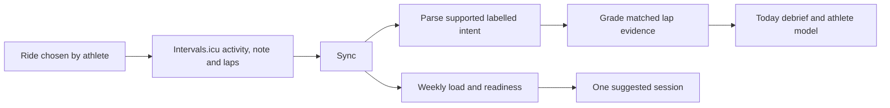

# 03 · Daily loop — with and without a block

Today uses the athlete's local date to select pre-ride or post-ride presentation. `SyncProvider`
provides shared state; [scoring](02-scoring-and-learning.md) and [nutrition](09-nutrition.md) own calculations.

## Morning (pre-ride)

| With an active block | Without an active block |
|---|---|
| Planned session and prescription | One session suggestion, if enough evidence exists |
| Readiness and ranked drivers | Readiness plus Load/Recovery/Execution summary |
| Athlete-confirmed morning adjustment | Weekly load envelope derived from prior tolerated load |
| Daily nutrition and eligible loading prompt | Daily nutrition from the same model |

Readiness is advisory. The illness/fatigue/injury check-in can change a planned session only after
confirmation: injury → rest; illness/fatigue → downgrade quality or rest on an easy day.
`morning-check.ts` owns the decision, `calendar-mirror.ts` the outbound change.

### Self-directed training with Intervals.icu

| Component | Contract |
|---|---|
| `weekly-envelope.ts` | Monday-resolved weekly TSS range; may tighten, never widen midweek |
| `session-suggestion.ts` | Uses focus selection and remaining envelope; creates no block or calendar event |
| `no-block-summary.ts` | Composes Load/Recovery/Execution text from existing signals |
| `intent-note-parser.ts` | Supported labelled bullets only; does not interpret arbitrary prose |
| `intent-runner.ts` | Fetches laps for supported intent; unsupported/ambiguous evidence stays ungraded |

A new athlete with no tolerated week gets no suggestion, not a zero-load prescription. External
Intervals.icu plans are not automatically imported as prescribed NodeVelo blocks. Intent overlays
let supported self-directed execution inform the model without rewriting the original ledger.

## After the ride

| Step | Output |
|---|---|
| `POST /api/sync` | Scores, zones, interval evidence, PRs, daily intake target |
| `POST /api/intent` | Deterministic interpretation/grading of supported self-directed notes |
| `POST /api/analyze` | Optional coach-note language; may also post a NOTE to Intervals.icu when configured |
| Today | Ride score/evidence, trace, fuel guidance, and disposition controls |

Deterministic Today finalization runs for supported rides with or without Anthropic configuration: zones, interval evidence, trace, score, fuel guidance, and today's ledger enrichment remain available. Only a missing optional coach note sets `analysisPending`, and only when Anthropic is configured.

A compromised disposition excludes the ride from teaching the model. Logged intake `0` means a
real fasted observation; it is not missing data. Personalized fuel nudges require trusted calibration.

## Missed/failed sessions

| Trigger | Behavior |
|---|---|
| Missed/compromised quality session | Suggest a future make-up subject to scheduling constraints |
| Confirmed morning downgrade | Swap onto a suitable easy day or deload |
| Accepted change | Commit locally, then mirror to Intervals.icu; report mirror failures |

## Common modifications

| Change | Start here |
|---|---|
| Readiness / state driver | `readiness.ts`, `athlete-state.ts`, `coach-snapshot.ts` |
| Morning decision | `morning-check.decideMorningCheck` |
| No-block guidance | Envelope, suggestion, and summary modules above |
| Debrief / intent display | `dashboard/today.tsx`, `dashboard/ride-intent.tsx` |
