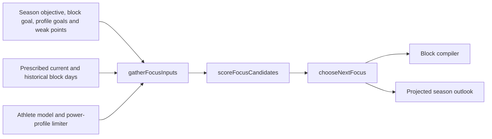

# 05 · Season — choosing the next focus

`season-signals.ts` assembles inputs; `season.ts` selects focus and projects the season outlook.
The generator consumes that selection. Profile goals are structured athlete data, not KB Markdown.

## The coverage selector

| Signal | Meaning / limitation |
|---|---|
| Goal relevance | Matches goal/weakpoint text, with negation-aware tags |
| Exposure / decay urgency | Uses prescribed block days up to today; skipped sessions can still count |
| Trainability and execution quality | Modify candidate suitability; execution comes from per-type EWMA |
| Limiter | Power-profile weak system biases selection; it does not replace the other inputs |

`gatherFocusInputs` is shared by `/api/generate` and `/api/season`. The former includes the proposed
block goal; the latter projects an outlook. `chooseNextFocus` selects the highest-ranked candidate
other than the last focus; it does not simply take the unfiltered top score.

## Two modes

| Behavior | No upcoming A-event | Upcoming A-event |
|---|---|---|
| Season state | Settle existing history | Replan backward from the event |
| Compiler focus | Rolling selector | Rolling selector |
| Compiler phase | `build` | `build` while `SEASON_SHAPES_GENERATION = false` |
| Event constraints | Existing events still enter the skeleton/gate | Existing events still enter the skeleton/gate |

The flag gates event-phase/context shaping, not all event behavior. Event replanning can also filter
recovery-week placement. See the actual inputs to `compileTrainingBlock` in `app/api/generate/route.ts`.

## Recovery weeks

`realWeeksSinceLastRecovery` reads actual ledger TSS against the athlete's weekly baseline.
`planRecoveryWeeks` schedules the next deloads; `block-skeleton.ts` owns their hour targets.
This uses ridden load, unlike the prescribed-session exposure signal above.

## Validators (post-generation, publication-gated)

Rolling focus/cadence checks and event-mode fit checks belong to the [publication gate](06-generation.md#the-publication-gate).
With the phase flag off, generation supplies rolling season context even if an A-event exists.
Season replanning is best-effort; its failure becomes a warning, not an exemption from other validators.

## Persistence rules

| Operation | Stored result |
|---|---|
| `/api/season` PUT | Athlete objective and events |
| Successful generation | Season replan in `season-plan.json`, guarded by `updatedAt` |
| `projectSeasonOutlook` | Display projection; no accepted future block |

## Season → Plan-page conveniences

`suggestedBlockWeeks` and `filterGoalsByFocus` prefill the generator. The athlete can edit both.
The outlook does not publish calendar events or lock future training choices.

## Known rough edges

| Boundary | Consequence / disposition |
|---|---|
| **P7: no pre-app exposure** | A system absent from NodeVelo block history gets elevated urgency, even if trained before app use. Goal-driven selection can mask this; it does not solve it. |
| **Prescribed is not ridden** | Exposure can count skipped sessions. Execution quality only partly compensates. Join against actual evidence only when a demonstrated selection error justifies it. |
| **Event taper coverage** | Standalone quality and embedded hard efforts are not treated identically by every validator; event-date exclusions remain priority-blind. Real A-event work is FR-11. |
| **Goal prefill** | A season refetch can overwrite an in-progress generator goal edit. |
| **Event display** | Peak/taper share `sharpen`; multiple A-events lack a dedicated ambiguity warning. |

The old P2/P3 composition failures led to the deterministic skeleton and compiler, now shipped
([generation](06-generation.md), [FR-5 evidence](../reviews/2026-08-29-fr5-acceptance.md)). Removed LLM
critics, prompt retries, and interval-authoring paths are not future work.

Retained decisions: full constraint solver and blockless rolling-horizon replacement rejected;
per-zone progression and weekly re-anchoring remain evidence-gated. [ROADMAP](../../ROADMAP.md) owns
reopen triggers; [shipment history](../history/shipments.md) preserves the old evaluations.

## Common modifications

| Change | Start here |
|---|---|
| Ranking / new signal | `scoreFocusCandidates` / `gatherFocusInputs` |
| Event behavior | `replanEventArc`, generator phase flag, skeleton and gate inputs |
| Deload timing | `realWeeksSinceLastRecovery`, `planRecoveryWeeks` |
