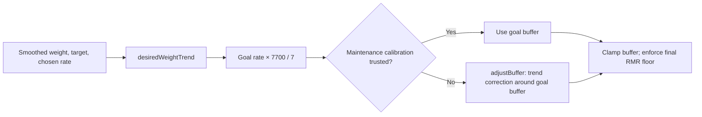

# 09 · Nutrition — daily targets and their derivation

`lib/nutrition.ts` owns energy and carbohydrate targets. Sync adopts calibration; Today and Profile
show its results. The compiler builds nutrition directly. `nutrition-validate.ts` retains compatibility
helpers; repairing AI-generated calories is not an active generation stage.

## The formula

```text
daily target = max(RMR, k_dayType × RMR + exercise burn + goal buffer)
```

| Input | Source | Uncertainty |
|---|---|---|
| RMR | Mifflin-St Jeor estimate from body measurements | Equation error is absorbed into calibrated maintenance |
| `k_dayType` | Logged intake, weight trend, and burn; separate rest/training values | Logging and burn errors also enter this solve |
| Exercise burn | Intervals.icu activity calorie figure, net of resting cost where applicable | An upstream estimate, not a direct metabolic measurement |
| Goal buffer | Desired weight-change rate × 7700 / 7, with limits | Chosen target and model assumptions |

Resolved active burn of zero means a rest day; unresolved burn means unknown, not rest.
Future plans use the prescribed day type. Both day types share the same formula.

### `k` covers NEAT and TEF, never exercise

The multiplier covers non-exercise expenditure and food processing. Exercise is added separately.
The configured plausibility band is relative to the RMR equation, not a measurement of physiology.

## Active burn: taken verbatim, then netted of its own resting cost

| Function / field | Contract |
|---|---|
| `activeBurn(a)` | Prefer `activeBurnKcal`; fall back to `kj` with `legacy: true`. Only absence of both returns `null`. Used for day-type classification. |
| `exerciseBurn(a, restingKcalPerHour)` | `max(0, source kcal − moving hours × restingKcalPerHour)`; use moving time, not elapsed time. |
| `NeatCalibration.basis` | Calibration and target must use the same gross/net basis. |
| Missing legacy `basis` | Keep the existing gross pairing until recalibration; test `basis === "net"`. |

The daily maintenance term already includes 24 hours of resting metabolism. Adding gross cycling
burn without adjustment counts those ride hours twice. Activity-specific netting lives in the burn
accessor; consumers must not duplicate it or substitute mechanical `kj` for calorie burn.

## Calibration — deriving `k` from the athlete's own data

```text
k = (sum intake − sum exercise burn − mass change × 7700) / (days × RMR)
```

| Rule | Reason |
|---|---|
| Intake, burn, and day count cover the same usable range | Avoid a false deficit from mismatched windows |
| Missing intake uses the logged mean, not zero | Missing transfer is not fasting |
| Insufficient evidence withholds calibration | Defaults must not appear as learned values |
| Out-of-band findings list alternative causes | Intake bias, burn error, and RMR error are not separately identifiable |
| Athlete override remains authoritative | Sync does not replace an override |

Only the product `k × RMR` is identifiable. A repeatable solve is not proof of measured metabolism.

### Coverage is measured over the *loggable* range, not the window

Measure from window start to the last logged day. Intake older than 14 days produces the distinct
`stale` state. Sparse coverage and stale transfer are different conditions.

### Weigh-in recency is required (a Critical, once)

Filter weigh-ins to the calibration window and reject adoption after a 14-day weigh-in lapse.
A high count of old readings cannot establish current confidence.

### Two weight-trend variants, deliberately

`weightTrendFromWellness` rounds for display; `weightTrendPreciseFromWellness` keeps precision for
calibration. Losing 0.04 kg/week to rounding shifts the energy solve by about 44 kcal/day.

### Day-type calibration: why rest maintenance can be higher

Solve rest and training subsets separately, then shrink each toward pooled calibration with
`weight = n / (n + 12)`. Five logged rest days give the rest-specific solve 29% weight.
The split is an empirical correction, not an extra recovery-calorie term or proof of higher rest-day NEAT.

## The buffer — feed-forward from the goal, not feedback on the trend



`resolveBuffer` uses goal-rate mode for trustworthy derived calibration; otherwise it uses the
trend fallback. Both start from the goal surplus. Its `_legacyBuffer` argument is ignored.

### Why it stopped being a servo

Trend-error-only control could preserve a surplus while the athlete intended to lose weight.
Goal-directed sign and a goal-rate base remove that ambiguity. Historical simulation results are in
the [buffer design](../superpowers/specs/2026-07-31-buffer-redesign-feedforward.md); they are not prospective validation.

### Direction always comes from the gap

`targetRateKgPerWeek` supplies magnitude; smoothed weight relative to target supplies direction.
The goal comparison uses a 14-day median, while RMR uses current mass.

### Two guards on the output

| Guard | Effect |
|---|---|
| ±0.7 kg goal deadband | Desired rate and goal-rate component become zero; the untrusted-calibration fallback may still add a trend correction |
| Final target ≥ RMR | Report `floored` when the unclamped target was lower |

The buffer is separately bounded to −500…600 kcal/day. Keep buffer limits distinct from the final floor.

## Why there is no separate rest-day formula

Separate formulas once made short training days prescribe less than a rest day because only the
training formula included the buffer. One identity removes that asymmetry. Legacy profiles without
RMR inputs retain hand-set values, with training targets floored at their rest-day target.

## Signals surfaced to the athlete

| Signal | Reference | Gate / caveat |
|---|---|---|
| Underfuel streak | Unbuffered maintenance + burn; ratio below 0.95 | Up to 7 logged days, none older than 14; at least 4 required |
| Weekly energy balance | Buffered prescription; low threshold 0.9 | Historical target reconstruction is approximate |
| Energy availability | Intake minus exercise burn per kg body mass | Body-weight proxy, not a clinical assessment |

Resolve day type per historical day. The streak and weekly-balance thresholds answer different
questions; do not unify them. An imbalance finding appears alongside the apparent deficit.

## Early goal-trend warning

Informational only: 21-day window, ≥7 weigh-ins, ≥14 usable intake days, estimated adherence
95–105%, and observed trend ≥0.15 kg/week above intended. It changes no calorie target or calibration.
Historical adherence uses today's model/buffer because final daily prescriptions are not persisted.

## The derivation panel

Profile exposes RMR → calibration → maintenance → smoothed weight → goal/trend → buffer → target.
Show the calculated value and RMR-floored result when the floor applies. Today presents the daily
prescription and relevant logging signals.

Profile PUT accepts `nutrition` and `performance` only as non-null, non-array objects when present.
Invalid section containers return 400 before any profile update, even when sibling fields are valid;
valid partial updates continue through the existing field validation and locked merge.

## Known rough edges

These are recorded sensitivities, not universal accuracy claims.

| Limitation | Observed consequence / boundary |
|---|---|
| Rest/training split shares one weight-drift estimate | Intake bias can masquerade as different expenditure. A 200 kcal/day training under-log produced a split despite identical true multipliers. |
| Gross burn previously double-counted resting cost | Netting removed about 30% of a measured 157 kcal/day day-type gap; roughly 109 remained unexplained. |
| Sustained non-energy mass changes | A +1 kg step across half a window could clamp calibration; a short transient was rejected. Body composition is unavailable. |
| Mean intake imputation | Recorded trending/missing-day cases biased targets upward by about 83/115 kcal/day. |
| No complete day-keyed target history | `weeklyEnergy` cannot compare intake to the exact prescription shown on every past day; ride-only stamps would omit rest days. |
| Missing off-bike calories | Require an upstream/manual calorie figure; missing does not mean zero activity. |
| RMR equation alternatives | Lean-mass equations require body-composition data; a calibrated multiplier already absorbs equation error. |

Prospective validation remains [FR-8](../../ROADMAP.md#fr-8--nutrition-evidence-contract-and-daily-carbohydrate-slice--blocked-until-phase-4-closes).

## Common modifications

| Change | Start here |
|---|---|
| Daily target / burn | `calculateDailyTarget`, `activeBurn`, `exerciseBurn` |
| Calibration / adoption | `calibrateNeat`, `calibrateNeatByDayType`, sync route |
| Goal steering | `resolveBuffer`, `desiredWeightTrend`, `adjustBuffer` |
| Carbohydrates / prompting | `preRideCarbTarget`, `inRideCarbTarget`, `fuel-prompt.ts` |
| Display | `AthleteProfileForm.tsx`, `dashboard/today.tsx` |

## Design history

[Accuracy design](../superpowers/specs/2026-07-30-day-to-day-nutrition-accuracy-design.md) ·
[Buffer redesign](../superpowers/specs/2026-07-31-buffer-redesign-feedforward.md) ·
[Rest-day investigation](../superpowers/specs/2026-08-01-rest-day-energy-model-review.md) ·
[Day-type implementation](../superpowers/plans/2026-08-01-day-type-neat-calibration.md)
